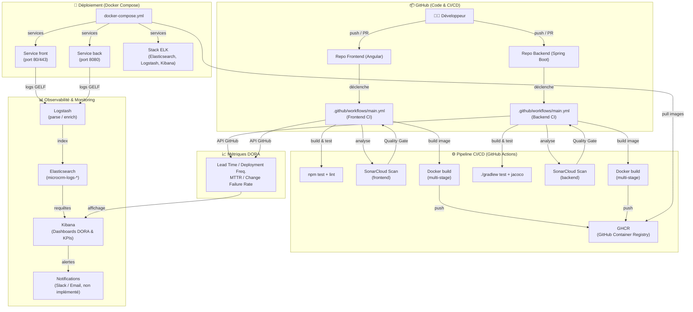

# MicroCRM - Déploiement Docker

Ce répertoire contient la configuration Docker Compose pour orchestrer le déploiement de l'application MicroCRM.
La stack inclut maintenant le Frontend, le Backend et l'observabilité avec ELK (Elasticsearch, Logstash, Kibana).

## Prérequis

- Docker Desktop (Windows/Mac) ou Docker Engine (Linux)
- Docker Compose

## Lancement de l'application

Pour démarrer l'ensemble des services (Frontend, Backend, Elasticsearch, Logstash et Kibana) :

```bash
docker-compose up
```
ou
```bash
docker-compose up --build
```
ou
```bash
docker-compose up --build -d
```

## Arrêt

```bash
docker compose down
```

## Sauvegarde et restauration des volumes

### Restauration du volume Elasticsearch

Après avoir arrêté le stack :

```bash
docker-compose down
```

Puis redémarrez :

```bash
docker-compose up -d
```

- Frontend : `http://localhost:80`
- Backend : `http://localhost:8080`
- Elasticsearch : `http://localhost:9200`
- Kibana : `http://localhost:5601`
- Logstash monitoring API : `http://localhost:9600`

## Vérification des logs dans Kibana

1. Ouvrir `http://localhost:5601`.
2. Aller dans **Stack Management > Data Views**.
3. Créer un Data View avec le pattern `microcrm-logs-*`.
4. Aller dans **Discover** pour visualiser les logs applicatifs.


Les logs des conteneurs `front` et `back` sont envoyés à Logstash via GELF, puis indexés dans Elasticsearch sous la forme `microcrm-logs-YYYY.MM.dd`.
**Dashboards :** La visualisation des données repose sur une **Data View** nommée `microcrm-logs`, configurée avec le pattern `microcrm-logs-*` et le champ temporel `@timestamp`. Cette Data View est le socle commun pour les dashboards "DORA Metrics" et "CI/CD Performance".

## Observabilité & Métriques DORA

Le projet intègre aussi une pile ELK (Elasticsearch, Logstash, Kibana) pour centraliser les logs applicatifs et suivre les métriques **DORA** (Deployment Frequency, Lead Time for Changes, etc.) en interrogeant l'API GitHub Actions.

### Configuration des Métriques (GitHub & SonarCloud)

Pour que Logstash puisse récupérer les données, configurez votre fichier `.env` :

1.  **GITHUB_TOKEN** : [Générer un PAT (classic)](https://github.com/settings/tokens) avec le scope `repo`.
2.  **SONAR_TOKEN** : Générer un token sur [SonarCloud](https://sonarcloud.io/account/security/).

Exemple de fichier `.env` :
```env
GITHUB_TOKEN=ghp_xxxx
SONAR_TOKEN=squ_xxxx
```

### KPIs disponibles dans Kibana

*   **Lead Time for Changes** : Via l'index `dora-metrics-*` (champ `duration_seconds` ou `lead_time_for_changes_human`).
*   **Temps de Build / Tests** : Basé sur la durée totale des workflows GitHub Actions.
*   **Dette Technique** : Via l'index `sonar-metrics-*` (champ `technical_debt_hours`).
*   **Taux d'erreurs Logs** : Via l'index `microcrm-logs-*`. Utilisez le champ `is_error` (1 pour erreur, 0 pour succès) pour calculer le ratio.


## Pour sauvegarder le volume:

```bash
docker run --rm -v elasticsearch-data:/volume -v ${PWD}:/backup node:20-alpine sh -c "cd /volume && tar czf /backup/elasticsearch-data-backup.tar.gz ."
```

## Pour restaurer le volume:


```bash
docker run --rm -v elasticsearch-data:/volume -v ${PWD}:/backup node:20-alpine sh -c "cd /volume && tar xzf /backup/elasticsearch-data-backup.tar.gz"
```

## Configuration Kibana (.env)

Kibana utilise un **service account token** et des cles de chiffrement stables.
Ajoutez ces variables dans votre fichier `.env` :

```env
ELASTICSEARCH_SERVICEACCOUNTTOKEN=eyJ2ZXIiOiI4LjE0LjMiLCJhZHIiOlsiLi4uIl0sImZsciI6Ii4uLiJ9...
KIBANA_SECURITY_ENCRYPTION_KEY=0123456789abcdef0123456789abcdef
KIBANA_ENCRYPTEDSAVEDOBJECTS_ENCRYPTION_KEY=abcdef0123456789abcdef0123456789
KIBANA_REPORTING_ENCRYPTION_KEY=fedcba9876543210fedcba9876543210
```

Les 3 cles Kibana doivent faire au moins 32 caracteres.

Pour generer/regenerer un token valide :

```bash
docker compose exec elasticsearch /usr/share/elasticsearch/bin/elasticsearch-service-tokens create elastic/kibana kibana-token
```

Copiez la valeur retournee (apres `=`) dans `ELASTICSEARCH_SERVICEACCOUNTTOKEN` du `.env`.


### Diagramme archi


